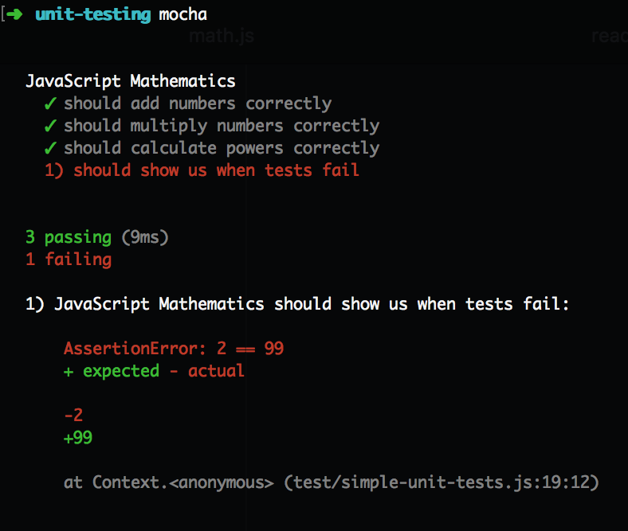

# Unit Testing

## Objectives
* Understand what a **Unit Test** is.
* Use the **Mocha** library to write simple **Unit Tests**.
* Convert project specification into **Unit Tests**.

A **Unit Test** is a program that verifies the correctness of a small piece of
your program. A **Unit Test** is good for making sure that your code produces
correct output for certain inputs. One piece of your program can have many
**Unit Tests** that test your program against many different possible inputs
to make sure it always has correct output.

**Unit Tests** are saved together in collections where they're grouped according
to the parts of your program they test. **Unit Tests** can be run according to
which group their grouped into, or all unit tests can be run at once.

**Unit Tests** help programmers show that their programs behave correctly.
**Unit Tests** are especially useful as projects grow larger, more complex, and
as more people are added to teams. Developers are able to make changes to code
and run the **Unit Tests** to make sure their changes didn't break anything.

Let's start writing our own **Unit Tests**!

# Unit Testing With Mocha
We'll use a test library called **Mocha** to help us write tests and see all the
results. **Mocha** is available through `npm`. We install it with the `--save-dev`
flag because it's only a development dependency. **Mocha** is not something that
needs to live in our application after we upload it to a live website in production.

# Writing Simple Tests
**Mocha** allows us to make test suites out of lots of small tests. We can `describe`
one piece of functionality and state all of the things `it` should do. **Mocha**
has several convenience functions to help us write tests:

* `assert` - this allows us to check for specific conditions. We can assert that `1 + 1`
  equals `2`.
* `it` - this represents one small test. The test may have several calls to `assert`.
  This function usually has a message starting with "it", like "it should add numbers
  correctly."
* `describe` - this collects several small tests into one broad description.

Here's a sample of how the **Mocha** functions all come together to test software.
Notice that we must import the `assert` function at the top of the program. The
`describe` and `it` functions are brought in by **Mocha** automatically.

Execute the file with `mocha` on the command line and naming the file specifically.
If you just run `mocha` **Mocha** will execute all the files in your `test` directory.

```js
mocha test/math.js
```

You'll see your command line appear with a nice summary of the tests you write.
There's different sections for each `describe` function as you grouped your tests
up. Each `it` function shows a small piece of functionality with either a nice
green check mark, or a red error indicator. You can see how many of your tests
passed, and how many failed.

Tests that fail come with a nice written description from the text you added to
the `describe` and `it` functions, and you can see the **expected** and
**actual** values that made the test fail so you can see what exactly went
wrong.

In our case, we can see it tells us `1) JavaScript Mathematics should show us when tests fail:`
and shows us it **expected** `1 + 1` to equal `99`. But the value it **actually**
saw was `2`. In this case, we wrote a bad test. We should replace `99` with `2` in
our test file to make sure the test passes.

It's actually a good idea to force some tests to fail when you're first starting
with a testing framework. If you don't see some tests fail, then how do you know
if a test will ever really fail!


# Installing Mocha
We'll install **Mocha** as a global command line tool that we'll use across
multiple projects. Installing **Mocha** globally will allow us to invoke `mocha`
from the command line.

**Mocha** expects their to be a directory called `test` at the top of our project.
We'll install **Mocha**, create a `test` directory, and create a new file in there
called `math.js` where we'll run a few simple math tests to get the hang of **Mocha**.

* Install the `mocha` module globally using `npm install -g mocha`.
* Create a directory called `unit-testing`.
* Change into the `unit-testing` directory.
* Create a directory called `test`.
* Create a file called `simple-unit-test.js` in the `test` directory.

```
npm install -g mocha
mkdir unit-testing
cd unit-testing
mkdir test
touch test/simple-unit-test.js
```

**Mocha** is a library that will help you write **Unit Tests** and run them. It
provides useful functions to group tests together, define individual tests, and
define assertations about the state of your program.

Here's what a minimal **Unit Test** looks like using **Mocha**. Copy this code
to your `test/simple-unit-test.js` file:

```js
var assert = require('assert');

describe("JavaScript Mathematics", function() {
  it("should add numbers correctly", function() {
    var actual = 1 + 1;
    var expected = 2;
    assert.equal(actual, expected);
  });

  it("should multiply numbers correctly", function() {
    assert.equal(9 * 8, 72);
  });

  it("should calculate powers correctly", function() {
    assert.equal(Math.pow(3, 3), 27);
  });

  // 1 + 1 does not equal 99.
  // This test is designed to fail intentionally.
  it("should show us when tests fail", function() {
    assert.equal(1 + 1, 99);
  });
});
```

Execute the test using `mocha` on the command line. Running `mocha` in the
`unit-testing` directory will make **Mocha** automatically look for a directory
called `test` and it will execute every `*.js` file it finds there.

```
mocha
```

You'll see a nice text report summarizing how many tests passed and failed, and
explanations showing exactly which tests failed. Notice that one of the tests
written includes an intentional failure so we can see how failures are presented.



# Explaining Mocha
Here's basically what the **Mocha** library provides:

* An `assert.equals()` function verifies values in our program.
* A function that defines each test and what `it()` should do.
* A function that groups tests together to `describe()` how a part of our program
  should behave as a whole.
  
The **Mocha** testing library provides the `describe()` and `it()` functions
because it likes to format tests as if you're grouping and labelling tests in
English. This actually helps when you run all the tests and it's able to print
out text that tells you exactly what's wrong with a program. Also, it helps
organize your thoughts as your writing tests.

Here's what the tests in the code above looks like in English:

```
JavaScript Mathematics Description:
  - it should add numbers correctly.
  - it should multiply numbers correctly.
  - it should calculate powers correctly.
  - it should show us when tests fail.
```

* `describe()` groups together `it()` functions.
* `it()` functions group together test code.
* `assert.equals()` functions test specific values in test code to make sure
  they're correct.

Here's what everything does in more detail:

* We can use `require('assert')` to gain access to a function that allows us to
  compare the equality of things in our program.
* `assert.equals()` does the bulk of the work in our **Unit Tests**. This
  function is what compares the `actual` output of our program to what we told
  the test the `expected` output should be.
* If `expected` matches `actual` the test passes.
* If `expected` does not match `actual` the test fails.
* `assert.equals(actual, expected)` has two parameters:
  * `actual` is the actual value that our program computes at runtime.
  * `expected` represents what we expect the correct value to be. We provide
    this value ourselves manually to tell the program what the computed value
    should be.
* `it(msg, function() {})` is a function that executes a small block of code.
  Each `it()` call represents one test case, or one **Unit Test**. Each **Unit
  Test** can be labeled with a `msg` string to help us identify what the **Unit
  Test** is testing.
* `describe(msg, function() {})` groups together multiple `it()` calls that have
  **Unit Tests** in order to create one collection of **Unit Tests** for a part
  of our program.

# Exercise: Testing findMinimumValue()
**Unit Tests** are perhaps most useful for the way they reveal bugs in programs.
Use the test code provided to find out what's wrong with the `findMinimumValue()`
function and fix the code so all tests should pass.

The `findMinimumValue()` function accepts an array as a parameter and returns
the smallest value in the array. Tests are already written with different
input and all their expected output. You should only have to modify the
`findMinimumValue()` function in order to get all the tests to pass.

Running `mocha` from the command line will make **Mocha** automatically look
for a `test` directory and execute all of the JavaScript files it finds inside.
If you want to run one specific file you can pass `mocha` the name of the one
file you want to run:

```
mocha test/find-minimum-value.js
```

# Reflection: Testing Edge Cases and Challenging Assumptions
The test code for `findMinimumValue()` does some specific things that are
considered good practices. Good test code covers **Edge Cases** and challenges
assumptions about a problem.

**Edge Cases** are conditions where your code needs to do something special in
order to behave correctly. Sometimes code handles general cases perfectly, but
it forgets to deal with certain special **Edge Cases**.

If your code deals with arrays arrays have common edge cases you should consider:

* What should happen if the array is empty?
* What should happen if there's only one thing in the array?
* What should happen with elements at the front of the array?
* What should happen with elements at the end of the array?

## Exercise: Calculating Temperature Spikes Edge Cases
Consider **Edge Cases** if you're trying to calculate the largest day-to-day
temperature increase from an array of daily temperatures. If the algorithm were
given `[72, 79, 99, 84, 86]` for daily weather temperatures it should return
`20` because the largest increase is `20` degrees between the days recording
temperatures of `79` and `99`.

Here's one algorithm that handles a general case very well, but doesn't deal
with certain **Edge Cases**.

What **Edge Cases** does this algorithm fail to handle?

Write your own **Unit Tests** to test edge cases you identify. After you have
several tests written that expose the strengths and weaknesses of the algorithm
then rewrite the algorithm so it passes all of your test cases.

```js
function maxWeatherSpike(weatherData) {
  var largestSpike = 0;
  for (var i = 0; i < weatherData.length; i++) {
    // calculate how much the temperature rose between this day and yesterday
    var dailyIncrease = weatherData[i] - weatherData[i - 1];
    
    // save the current dailyIncrease if it beats the previous largestSpike.
    if (dailyIncrease > largestSpike) {
      largestSpike = dailyIncrease;
    }
  }
  return largestSpike;
}
```

## Solution: Calculating Temperature Spikes Edge Cases
* The program will crash if the array only has one item in it.
* The program will crash the first time the for loop runs when it tries
  to access `weatherData[i - 1]` when `i` starts at `0`.
* The problem itself is ill-defined for how it should behave it if it gets
  an empty array. Is it truly accurate to say that the largest temperature spike
  was `0` if no weather data was passed to it?
  * It might be OK if `0` is returned. That's one possibility.
  * It might be OK if `undefined` is returned. That's another possibility.
  * The important thing is that we're aware of this edge case and we've talked
    to customers, team-members, product designers and managers to make sure
    that everyone is on the same page about how this should be handled.
